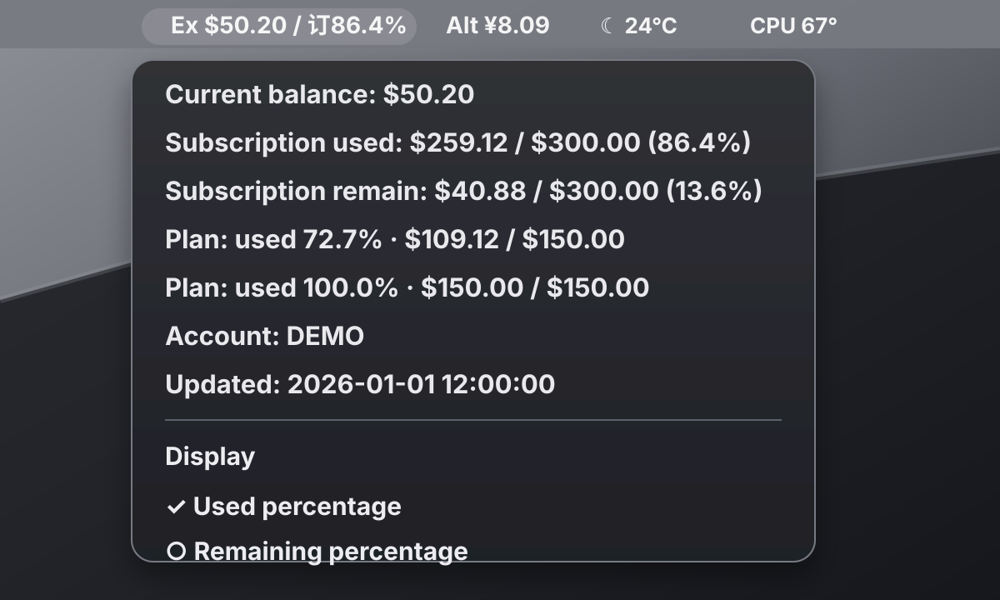

# SwiftBar Balance Monitor Skill

Build a local macOS menu bar monitor for API balance, wallet quota, subscription usage, and relay-site spending with SwiftBar or xbar.



This repository is a Codex Skill. It teaches Codex how to work with a user step by step: inspect the user's site, find the relevant wallet/profile/subscription APIs, create a site-specific Python adapter, generate SwiftBar plugin entries, keep secrets local, and refine the menu until it looks right.

It is designed for websites that are too different to support with one universal app. Each site gets a small adapter, but the project structure, SwiftBar output, privacy rules, display-mode toggles, and validation flow are reusable.

## What It Helps You Build

A finished monitor can show things like:

- Menu bar balance, for example `Ex $50.20 / 订86.4%`.
- Dropdown balance details.
- Daily or monthly usage.
- Subscription used and remaining quota.
- Per-subscription usage percentages.
- Account name.
- Last update time.
- Menu actions such as refresh, open wallet, and switch between used/remain percentage.

The generated templates already include the SwiftBar no-op row pattern:

```text
Balance: $50.20 | bash=/usr/bin/true terminal=false
```

That keeps display-only rows readable instead of macOS rendering them as disabled gray text.

## Install The Skill

Clone this repository into your Codex skills directory:

```bash
mkdir -p "${CODEX_HOME:-$HOME/.codex}/skills"
git clone https://github.com/CoimgRain/swiftbar-balance-monitor.git \
  "${CODEX_HOME:-$HOME/.codex}/skills/swiftbar-balance-monitor"
```

Restart Codex or open a new Codex session so the skill metadata is loaded.

Then ask Codex something like:

```text
Use $swiftbar-balance-monitor to build a SwiftBar menu bar monitor for my API balance website.
```

For interface discovery and authentication debugging, use a strong high-reasoning model when available, such as GPT-5.5 with high or xhigh reasoning. Simpler template edits can use a faster model.

## Requirements

- macOS.
- [SwiftBar](https://swiftbar.app/) or xbar.
- Python 3.
- A logged-in browser session, cookie, API token, or other local auth method for the target website.
- Codex with Skills support.

## How The Setup Works

Codex should guide the user through this flow:

1. Confirm the target site, menu label, currency, and what should be shown.
2. Inspect wallet/profile/usage/subscription APIs from DevTools, site assets, or existing scripts.
3. Create one service folder and one SwiftBar plugin entry.
4. Implement `fetch_usage.py` for that specific site.
5. Store runtime secrets locally in ignored files or environment variables.
6. Validate Python syntax and SwiftBar output.
7. Start or restart SwiftBar pointed at the `swiftbar-plugins/` folder.
8. Ask the user to confirm the menu result and iterate.

This is usually not perfect in one pass. Websites differ in quota units, subscription fields, auth behavior, names, and UI preferences. After the first working version, the user can ask to change labels, percentages, ordering, refresh interval, displayed fields, colors/readability, or actions.

## Scaffold A Monitor Project

The skill includes a reusable scaffold script. From the skill directory:

```bash
python3 scripts/scaffold_monitor.py \
  --output ~/balance-monitor \
  --service-id example-relay \
  --label Ex \
  --currency '$' \
  --subscription-prefix '订' \
  --base-url-default https://example.com
```

It creates:

```text
balance-monitor/
  actions/
    example-relay-display-used.sh
    example-relay-display-remain.sh
  example-relay/
    fetch_usage.py
  swiftbar-plugins/
    01-example-relay.1m.sh
  .gitignore
```

Then edit:

```text
~/balance-monitor/example-relay/fetch_usage.py
```

Implement `fetch_all()` for the target site's real API response.

## Start SwiftBar

Point SwiftBar at the plugin folder, not the project root:

```bash
PLUGIN_DIR="$HOME/balance-monitor/swiftbar-plugins"
open -a SwiftBar --args --folders "$PLUGIN_DIR"
```

To restart:

```bash
PLUGIN_DIR="$HOME/balance-monitor/swiftbar-plugins"
pkill -f '/Applications/SwiftBar.app/Contents/MacOS/SwiftBar' || true
open -a SwiftBar --args --folders "$PLUGIN_DIR"
```

Validate:

```bash
python3 -m py_compile "$HOME/balance-monitor/example-relay/fetch_usage.py"
"$HOME/balance-monitor/swiftbar-plugins/01-example-relay.1m.sh"
ps aux | rg -i '[S]wiftBar'
```

## Privacy And Publishing

Never publish runtime state or credentials:

- `state.json`
- `cache.json`
- `cookies.txt`
- `.env`
- HAR files
- screenshots with account details
- browser exports
- real account names, phone numbers, emails, cookies, tokens, or passwords

Before uploading a monitor project or sharing code, run:

```bash
python3 scripts/privacy_scan.py /path/to/project
```

The demo image in this repository is sanitized and uses fake data.

## Repository Contents

```text
SKILL.md
agents/openai.yaml
assets/
  demo-swiftbar-balance-monitor.svg
  templates/
    fetch_usage.py.tpl
    gitignore.tpl
    set_display_mode.sh.tpl
    swiftbar_plugin.sh.tpl
references/
  adapter-notes.md
  swiftbar-output.md
scripts/
  privacy_scan.py
  scaffold_monitor.py
```

## License

No license has been selected yet. Add one before distributing beyond personal or internal use.
