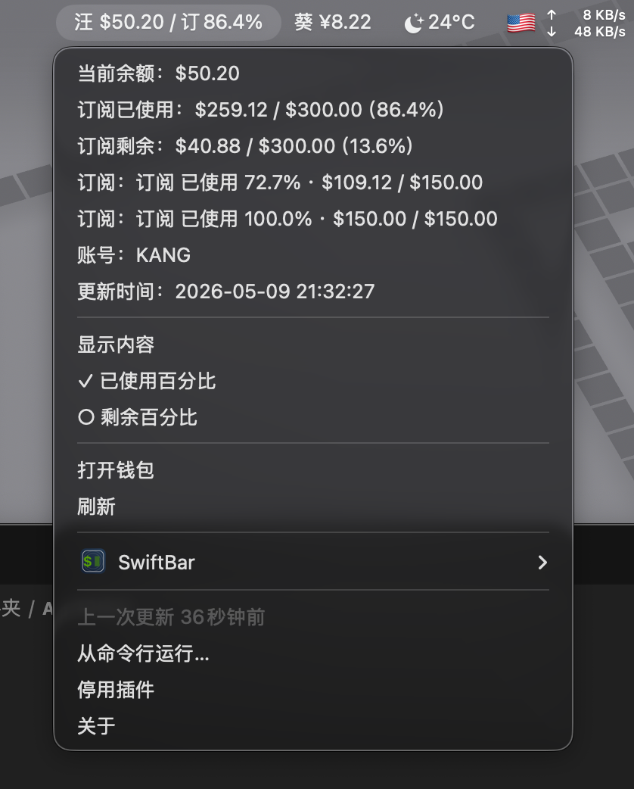

# SwiftBar 余额监控 Skill

用 SwiftBar 或 xbar 在 macOS 菜单栏里显示 API 余额、钱包额度、订阅用量和中转站消耗。



这是一个 Codex Skill。它的作用不是提供一个写死的网站监控 App，而是教 Codex 按用户的网站一步一步配置：查看网站接口、找到钱包/账号/订阅数据、写对应的 Python 适配脚本、生成 SwiftBar 插件入口、把密钥和登录态留在本地，并持续调整菜单栏文字和下拉内容，直到效果符合用户习惯。

这类网站差异很大，很难用一个通用应用完全覆盖。每个网站都可以有自己的小适配器，但目录结构、SwiftBar 输出格式、隐私规则、显示模式切换和验证流程都可以复用。

## 可以做什么

最终效果可以包括：

- 菜单栏余额，例如 `汪 $50.20 / 订86.4%`。
- 下拉里的余额详情。
- 今日消耗、本月消耗。
- 订阅已使用额度和剩余额度。
- 每个订阅单独的使用百分比。
- 账号名。
- 更新时间。
- 刷新、打开钱包、切换已使用/剩余百分比等菜单动作。

生成模板已经默认处理 SwiftBar 下拉文字变灰的问题。展示行会自动带上无副作用动作：

```text
余额：$50.20 | bash=/usr/bin/true terminal=false
```

这样 macOS 不会把这些纯展示行当成禁用菜单项渲染成灰色，点到也不会执行真正操作。

## 安装 Skill

把这个仓库克隆到 Codex 的 Skills 目录：

```bash
mkdir -p "${CODEX_HOME:-$HOME/.codex}/skills"
git clone https://github.com/CoimgRain/swiftbar-balance-monitor.git \
  "${CODEX_HOME:-$HOME/.codex}/skills/swiftbar-balance-monitor"
```

然后重启 Codex，或者打开一个新的 Codex 会话，让 Skill 元数据重新加载。

之后可以这样对 Codex 说：

```text
使用 $swiftbar-balance-monitor，帮我给这个中转站网站做一个 SwiftBar 菜单栏余额监控。
```

如果需要分析网站接口、登录态、订阅字段和额度单位，建议使用高推理模型，例如 GPT-5.5，并开启 high 或 xhigh reasoning。只是改文字、改模板这类简单任务，可以用更快的模型。

## 使用前准备

你需要：

- macOS。
- SwiftBar 或 xbar。
- Python 3。
- 目标网站的登录态、Cookie、API Token，或已经登录的网站页面。
- 支持 Skills 的 Codex。

## 配置流程

Codex 应该按这个流程帮用户做：

1. 确认要监控的网站、菜单栏简称、货币符号和想显示的内容。
2. 从浏览器开发者工具、网站前端资源或已有脚本里寻找钱包、账号、用量、订阅接口。
3. 为这个网站创建一个服务目录和一个 SwiftBar 插件入口。
4. 为这个网站实现 `fetch_usage.py`。
5. 把 Cookie、Token、缓存等运行状态保存在本地忽略文件或环境变量里。
6. 验证 Python 语法和 SwiftBar 输出。
7. 启动或重启 SwiftBar，并确认它只扫描 `swiftbar-plugins/` 目录。
8. 让用户看菜单栏效果，再根据反馈继续调整。

这类监控通常不是一次就能完全生成好的。不同网站的额度单位、订阅字段、登录方式、接口返回和用户偏好都可能不一样。先做出可运行版本，再根据用户反馈继续改字段、文字、百分比、刷新频率、显示顺序、颜色和菜单动作。

## 生成监控项目骨架

Skill 里带了一个可复用脚手架脚本。在 Skill 目录里运行：

```bash
python3 scripts/scaffold_monitor.py \
  --output ~/balance-monitor \
  --service-id example-relay \
  --label 汪 \
  --currency '$' \
  --subscription-prefix '订' \
  --base-url-default https://example.com
```

它会生成：

```text
balance-monitor/
  actions/
    example-relay-display-used.sh
    example-relay-display-remain.sh
  example-relay/
    fetch_usage.py
  swiftbar-plugins/
    01-example-relay.1m.sh
  .gitignore
```

然后编辑：

```text
~/balance-monitor/example-relay/fetch_usage.py
```

把其中的 `fetch_all()` 改成目标网站真实接口的读取和字段映射逻辑。

## 启动 SwiftBar

让 SwiftBar 扫描插件入口目录，不要扫描项目根目录：

```bash
PLUGIN_DIR="$HOME/balance-monitor/swiftbar-plugins"
open -a SwiftBar --args --folders "$PLUGIN_DIR"
```

如果要重启刷新：

```bash
PLUGIN_DIR="$HOME/balance-monitor/swiftbar-plugins"
pkill -f '/Applications/SwiftBar.app/Contents/MacOS/SwiftBar' || true
open -a SwiftBar --args --folders "$PLUGIN_DIR"
```

验证命令：

```bash
python3 -m py_compile "$HOME/balance-monitor/example-relay/fetch_usage.py"
"$HOME/balance-monitor/swiftbar-plugins/01-example-relay.1m.sh"
ps aux | rg -i '[S]wiftBar'
```

## 隐私和发布检查

不要公开上传运行状态和凭据：

- `state.json`
- `cache.json`
- `cookies.txt`
- `.env`
- HAR 文件
- 带账号信息的截图，除非你明确决定公开展示
- 浏览器导出文件
- 真实账号名、手机号、邮箱、Cookie、Token、密码

分享代码或上传仓库前运行：

```bash
python3 scripts/privacy_scan.py /path/to/project
```

本仓库首页使用的是一张真实效果截图，用来展示最终菜单栏观感。发布你自己的项目时，请先确认截图里没有不想公开的账号、余额、时间、桌面背景或其他个人信息。

## 仓库内容

```text
SKILL.md
agents/openai.yaml
assets/
  swiftbar-balance-monitor-screenshot.png
  templates/
    fetch_usage.py.tpl
    gitignore.tpl
    set_display_mode.sh.tpl
    swiftbar_plugin.sh.tpl
references/
  adapter-notes.md
  swiftbar-output.md
scripts/
  privacy_scan.py
  scaffold_monitor.py
```

## 许可证

暂时还没有选择许可证。如果要作为公开项目长期分发，建议后续补一个明确的开源许可证。
